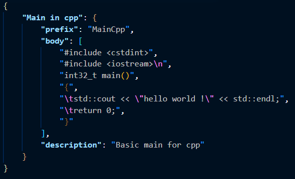
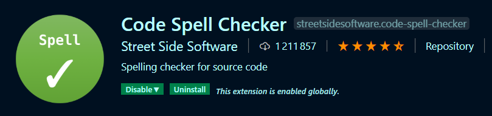
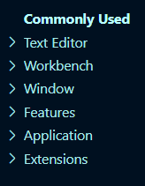
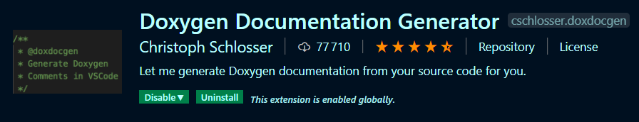
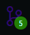
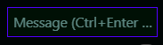
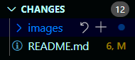

# Coder rapidement et efficacement

Bonjour, et bienvenu dans ce workshop sur la thématique de **Visual Studio Code** _l'éditeur de code extensible, multiplateforme et open source_ dévelloppé par **Microsoft**.

Le but de ce workshop est de découvrir l'éditeur de code **Visual Studio Code**.
Nous allons évoquer les points suivants :

- [L'installation](#Installation)
- [Les Bases](#WorkFlow)
  - [Ouvrir un fichier](#ouvrir-un-fichier)
  - [Ouvrir un projet](#ouvrir-un-projet)
  - [Créer un fichier](#créer-un-fichier)
  - [Sauvegarder](#Sauvegarder-un-fichier)
- [Les raccourcis clavier](#les-raccourcis-clavier)
  - [Tous les raccourcis claviers](#configurer-ces-raccourcis-clavier)
  - [Une poigné de raccourcis utiles](#Des-raccourcies-clavier-utils)
- [Les snippets](#les-users-snippets)
  - [Qu'est-ce que c'est ?](#qu'est-ce-que-c'est)
  - [Comment créer les siennes](#création-de-snippets)
- [Les extensions](#les-extensions)
  - [Qu'est ce que c'est ?](#Démistification)
  - [Configurer une extension](#configuration-des-extensions)
  - [Un exemple](#Un-example-avec-Doxygen)
- [La gestion d'un projet avec git](#Gestion-de-git)
- [Les tasks](#les-tasks)
- [Comment déboguer un programme](#Le-debogueur)

---

## Installation

Pour installer vscode sur votre machine on vous conseil de suivre ce [lien](https://code.visualstudio.com/download) qui mène directement au site officiel de l'éditeur qui vous aide pour installer leur outil, selon l'OS sur lequel vous vous trouver.

## WorkFlow

### Ouvrir un fichier

Une fois Visual Studio code installer vous pouvez l'ouvrir en tapant la commande suivante

```
$> code
```

Une fois l'application ouverte, vous pouvez ouvrir un fichier grâce aux raccourcis claviers **Ctrl + o** ou utiliser l'interface graphique en allant cliquer en haut à gauche sur File puis sur la ligne `Ouvrir un fichier`.


> Tu peux aussi faire le tout en une fois avec la commande qui suit

```
$> code ./Path/To/File
```

### Ouvrir un projet

Pour ouvrir directement un projet, plusieurs méthode s'offre à vous :

```
$> code path/to/folder
```

ou une fois l'application ouverte
**Ctrl + k, Ctrl + o**

> Ou en utilisant l'interface graphique en allant cliquer en haut à gauche sur File puis sur la ligne `Ouvrir un Dossier`

### Créer un fichier

Quoi de plus basic comme commande pour un éditeur de texte que de créer un fichier afin de pouvoir commencer à éditer du texte.

Et bien sur `vscode` la marche à suivre est la suivante:

- sur l'interface graphique de même que pour créer un fichier Cliquer sur File puis choisissez la ligne `New File`
- Ou le raccourci clavier **Ctrl + n**
- Ou la commande sur le terminal :

```
$> code NameOfTheNewFile
```

### Sauvegarder un fichier

Pour sauvegarder vos changements, il vous suffit d'utiliser le raccourci clavier **Ctrl + s**

## **Les raccourcis claviers**

### **Des raccourcies claviers utiles**

|       macOS        |     Windows      |      Linux       |                   Effets                    |
| :----------------: | :--------------: | :--------------: | :-----------------------------------------: |
|      ⌥↓ / ⌥↑       |    Alt+ ↓ / ↑    |    Alt+ ↓ / ↑    |       bouge la ligne vers le haut/bas       |
|        ⇧⌘K         |   Ctrl+Shift+K   |   Ctrl+Shift+K   |              supprime la ligne              |
|         ⌘/         |      Ctrl+/      |      Ctrl+/      |       commenter/décommenter une ligne       |
|         ⌘T         |      Ctrl+T      |      Ctrl+T      |            recherche par symbole            |
|         ⌘P         |      Ctrl+P      |      Ctrl+P      |      navigation à travers les fichiers      |
|      ⇧⌘P, F1       | Ctrl+Shift+P, F1 | Ctrl+Shift+P, F1 |        ouvre le panneau de commande         |
|         ⌘,         |      Ctrl+,      |      Ctrl+,      |            ouvre les paramètres             |
|        ⌥⌘F         |      Ctrl+H      |      Ctrl+H      |                  remplace                   |
|     ⌥ + click      |    Alt+Click     |    Alt+Click     |             ajouter un curseur              |
| Ctrl + Alt + ↑ / ↓ | Ctrl+Alt+ ↑ / ↓  | Shift+Alt+ ↑ / ↓ |     ajouter un curseur vers le haut/bas     |
|        ⌘F2         |     Ctrl+F2      |     Ctrl+F2      | sélectionne les occurrences de la sélection |
|       ⌃Space       |    Ctrl+Space    |    Ctrl+Space    |      ouvre le panneau des suggestions       |
|       ⌘K ⌘X        |  Ctrl+K Ctrl+X   |  Ctrl+K Ctrl+X   |      supprime les indentations en trop      |

Pour plus d'information concernant les raccourcie clavier : [Windows](https://code.visualstudio.com/shortcuts/keyboard-shortcuts-windows.pdf), [MacOS](https://code.visualstudio.com/shortcuts/keyboard-shortcuts-macos.pdf), [Linux](https://code.visualstudio.com/shortcuts/keyboard-shortcuts-linux.pdf).

### Le Key binding

Fenêtre de configuration : **Ctrl + k + s** ou File > Preferences > Keyboard Shortcuts.

il est possible de configurer des raccourcies clavier pour faire des action d'un extension ou d'un user snippet.

---

## Les user snippets

### Qu'est-ce que c'est

Un user snippet est un bout de code que vous allez pouvoir ajouter automatiquement en tapant une commande dans l'éditeur.

je vous invite, dans le fichier test.js, à taper log et de valider la suggestion intellisens (si aucune suggestion n'apparaît référez vous à la rubrique précèdent sur les raccourcies clavier :wink:).

### création de snippets

Dans un premier temps ouvrez le panneau de commande (raccourcie clavier :stuck_out_tongue_winking_eye:) et tapez "snippet" et sélectionnez la commande "Préférence: Configure User Snippets".

Choisissez le langage dans lequel vous voulez ajouter des snippets.

Si vous n'avez jamais expérimenté les snippets il y a du code commenté avec des instructions et un exemple (ne passez pas à côté de la lecture des instructions, vous pourriez manquer des informations intéressantes).



Je vous laisse donc vous amusez un peu avec ce nouveau jouer :grin:.

Un outil pour générer des [snippets](https://snippet-generator.app/).

---

## Les extensions

### Démystification

Les extensions VSCode son outil **FABULEUX** qui va vous changer la vie :heart_eyes:.

Il en existe de toute sorte et pour n'importe quoi.

**Ctrl + Shift + x** ou appuyez sur  pour accéder au panneau des extensions.

Je vous invite à rechercher l'extension Code Spell Checker et lire la description de l'extension (fini les fautes de norme pour des noms de variable qui n'existe pas).



Prenez un peu de temps maintenant pour vous balader dans cette jungle aux merveilles :grin:.

### Configuration des extensions

Ouvrez les paramètres (raccourcis cl... :no_mouth:).

Vous avez le choix entre plusieurs onglets en haut à gauche.



Sélectionnez celui des extensions. Choisissez ensuite l'extension que vous voulez configurer.

### Un exemple avec Doxygen

Si vous n'avez pas l'extension d'installer : Doxygen Documentation Generator.



Reproduisez les étapes de la rubrique précèdant pour l'extension Doxygen.

N'hésitez pas à tout casser dans les configurations (de l'extension bien sûr...) car elles peuvent toutes être reset.

Les fichiers sources sont à votre disposition pour différents test.

Un chouette [article](https://medium.com/swlh/60-extensions-to-supercharge-visual-studio-code-2f93a51b3cf4) à examiner.

---

## Gestion de git

VSCode propose un outil pour la gestion de git très efficace.

Ctrl + Shift + g ou  pour y accéder. Vous y trouverez déjà plusieurs fichiers. Commençons par les icônes en haut. La première ne sert à rien, les quatre autres sont utiles et servent respectivement à changer l'arborescence des fichiers , valider le commit , refresh le gestionnaire  et un menu d'action  très utile que je vous invite à examiner.

La seconde partie est tout simplement le champ dans lequel vous allez entrer le message de votre commit.



Et enfin, la troisième partie est là pour connaître et gérer les statues de vos fichiers et aussi gérer quel fichier vous voulez intégrer à votre commit.



---

## Les tasks

Les tasks sont un moyen pour interfacer votre projet et votre éditeur de code !

### Interfacer un Makefile

Dans nos projets à Epitech, nous sommes souvent amenés à créer des Makefiles pour :

- Compiler notre projet en mode "release"
- Nettoyer notre repo
- Lancer nos tests
- Compiler notre programme en mode "debug"

Ici, nous allons grâce aux task faire en sorte de ne plus avoir à taper les commandes dans notre terminal pour effectuer ces actions.

> Veuillez vous assurer de copier un de vos makefile pour voir si cela fonctionne correctement

#### Introduction

Pour cela je vous invite à faire **Ctrl + Maj + p** et à entre dans le prompt "task" une série d'action vont vous être proposé, choisissez `Configure task`, si vous n'en avez fait, on va vous demandez si vous voulez créer le fichier `tasks.json` qui va être le fichier de configuration de vos tasks à partir d'une template choisissez `Others`.

Vscode va alors créer pour vous un exemple de task basic dans le fichier `tasks.json`


Nous allons essayer de lancer cette tâche !

- **Ctrl + Maj + p**
- On filtre les propositions en écrivant "task".
- On choisit la commande "Run Task".
- On choisit la task avec le nom par défaut (ici: "echo").
- On nous propose de scanner la sortie, Choisissez ici de continuer sans scanner dans un premier temps.

Et voilà :


#### Compiler

Pour notre première tâche nous allons simplement modifier celle, qui nous à été donnés par défaut.

- Remplacer "echo Hello" par "make"
- Remplacer "echo" par "build"

Et voilà


Pour en rajouter, il vous suffit de copier coller :

```JSON
{
    "label": "Nom de ma tâche",
    "type": "shell",
    "command": "commande à effectuer dans un terminal"
},
```

On vous laisse faire les autres actions :

- Nettoyer le repo
- Compiler en mode debug
- Compiler et lancer les tests

---

## Le débogueur

### Introduction

Le débogage est l'action d'enlever les bugs, et pour faciliter cette action de trouver et enlever les bugs, des débogueurs ont été inventés.

Il se trouve que **Visual Studio Code** possède un support natif pour un débogueur Javascript capable de prendre en charge tout langage pouvant être compilé en javascript.

### Comment utiliser le déboguer intégré ?

_On se familiarise avec le debugger intégré._

C'est le quatrième icône sur la droite ou le raccourcis **Ctrl + k, Ctrl + s**.

- Pour le lancer, il vous suffit d'aller sur un fichier que vous voulez déboguer et appuyez soit sur le bouton de l'interface à droite ou sur le raccourci clavier **F5**.
  Essayer avec le fichier `test.js`.

Si vous avez réussi vous devrez avoir un output similaire devant vous.


En guise d'exemple, mettez un "point d'arrêt" à la ligne 19 (regarder comment faire grâce au raccourcis **Ctrl + k, Ctrl + s**, ou en cliquant à gauche du nombre de la ligne).

Lancer de nouveau le débogueur !

Vous devriez ce coup-ci avoir quelque chose qui ressemble à cela :


Sur la gauche, on retrouve les **variables** présentes là où notre programme s'est arrêté. Par exemple, on voit bien que la variables `jeSuisUneVariable` a pour valeur `undefined`.

Alors que si je fais avancer mon programme d'une ligne, ici grâce au bouton , dans la barre d'outil du débogueur 

On voit que la valeur de la variable `jeSuisUneVariable` à changer et à maintenant la valeur `42`.

Vous êtes maintenant sur la ligne 21, vous êtes sur une fonction et vous aimeriez suivre l'exécution de celle-ci : Appuyer sur F11 ou cliquer sur le bouton  et vous voilà à la première ligne de votre function prêt à débugger votre function !

Pour continuer l'exécution du program appuyer sur **F5**.

Pour plus d'information allez voir cette [page](https://code.visualstudio.com/docs/editor/debugging)
