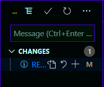

# Coder rapidement et efficacement

---

## **Les raccourcis clavier**

### configurer ces raccourcis clavier

Fenêtre de configuration: Ctrl + k + s ou File > Preferences > Keyboard Shortcuts.

### **Des raccourcies clavier utils**

|     raccourcies      |                  effets                  |
| :------------------: | :--------------------------------------: |
|     Alt + ↑ / ↓      |      bouge la line vers le haut/bas      |
|   Ctrl + shift + k   |             supprime la line             |
| Ctrl + shift + Enter |         insert une line a dessus         |
|       Ctrl + /       |     commenter/decommenter une ligne      |
|       Ctrl + t       |          recherche par symbole           |
|       Ctrl + p       |    navigation à travers les fichiers     |
|   Ctrl + Shift + p   |       ouvre le pannaux de commande       |
|       Ctrl + ,       |           ouvre les paramètres           |
|       Ctrl + h       |                 remplace                 |
|     Alt + Click      |            ajouter un curseur            |
|  Ctrl + Alt + ↑ / ↓  |   ajoute une curseur vers le haut/bas    |
|      Ctrl + f2       | sélectione les occurence de la sélection |
|     Ctrl + space     |     ouvre le pannaux des suggestions     |
|     Ctrl + k + x     |     supprime les indentaion en trop      |

Pour plus d'information concernent les raccourcie clavier: <https://code.visualstudio.com/shortcuts/keyboard-shortcuts-windows.pdf>

---

## Les user snippets

Un user snippet est un bout de code que vous allez pouvoir ajouter automatiquement en tapant une commande dans l'éditeur.

je vous invite, dans le fichier test.js, à taper log et de valider la suggestion intellisens (si aucune suggestion n'apparaît référer vous à la rubrique précèdent sur les raccourcies clavier :wink:).

### création de snippets

Dans un premier temps ouvrez le panneau de commande (raccourcie clavier :stuck_out_tongue_winking_eye:) et tapez "snippet" et sélectionnez la commande "Preference: Configure User Snippets".

Choisissez le langage dans lequel vous voulez ajouter des snippets.

Si vous n'avez jamais expérimenter les snippets il y a du code commenté avec des instructions et un exemple (ne passez pas à côté de la lecture des instructions, vous pourriez manquer des informations intéressantes).

Je vous laisse donc vous amusez un peu avec ce nouveau jouer :grin:.

Un outil pour générer des snippets: <https://snippet-generator.app/>

---

## Les extension

Les extensions VSCode son outil **FABULEUX** qui va vous changer la vie :heart_eyes:.

il en existe de toute sorte et pour n'importe quoi.

Ctrl + Shift + x pour accéder au panneau des extensions.

Je vous invite à rechercher l'extension Code Spell Checker et lire de descriptif de l'extension (fini les fautes de norme pour des noms de variable qui n'existe pas).

Prenez un peu de temps maintenant pour vous balader dans cette jungle au merveille :grin:.

### configuration des extensions

Ouvrez les paramètres (raccourcis cl... :no_mouth:).

Vous avez le choix entre plusieurs onglets en haut à gauche. Sélectionnez celui des extension. Choisissez ensuite l'extension que vous voulez configurer.

### Un example avec Doxygen

Si vous n'avez pas l'extension d'installer: Doxygen Documentation Generator.

Reproduisez les étapes de la rubrique précèdent pour l'extension Doxygen.

N'hésitez pas à tout casser dans les configurations (de l'extension bien sûr...) car elles peuvent toutes être reset.

Les fichiers sources sont à votre disposition pour différents testes.

> un chouette article à examiner : <https://medium.com/swlh/60-extensions-to-supercharge-visual-studio-code-2f93a51b3cf4>

---

## Gestion de git

VSCode propose un outil pour la gestion de git très performent.

Ctrl + Shift + g pour y accéder. Vous y trouverez déjà plusieurs fichiers. Commençons par les icônes en haut. La première ne sert à rien, les quatre autres sont utile et servent respectivement à changer l'arborésence des fichier, valider le commit, refresh le gestionaire et un menu avec beaucoups d'action très utile que je vous invite à examiner.

La seconde partie est tout simplement le champs dans le quelle vous allez entré le message de votre commit.

Et enfin la troisième partie est la pour connaître et gerer les statues de vos fichier et aussi gerer quel fichier vous voulez intégré à votre commit.

---

## Le debogueur

---

## Les tasks
