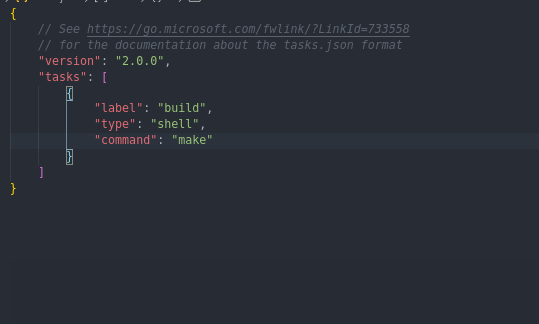
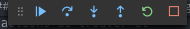

# Coder rapidement et efficacement

Bonjour, et bienvenu dans ce workshop sur la thématique de **Visual Studio Code** _l'éditeur de code extensible, multi-platforme et open source_ dévellopé par **Microsoft**.

Le but de ce workshop est de découvrir l'éditeur de code **Visual Studio Code**.
Nous allons évoqués les points suivants :

- [L'installation](#Installation)
- Workflow
  - ouvrir un fichier
  - ouvrir un project
  - créer un fichier/dossier
  - Naviguer dans l'éditeur
- [Les raccourcis clavier](#les-raccourcis-clavier)
  - [Tout les raccourcis clavier](#configurer-ces-raccourcis-clavier)
  - [Une poigné de raccourcis utiles](#Des-raccourcies-clavier-utils)
- [Les snippets](#les-users-snippets)
  - [Qu'est-ce que c'est ?](#qu'est-ce-que-c'est)
  - [Comment créer les siennes](#création-de-snippets)
- [Les extensions](#les-extensions)
  - [Qu'est ce que c'est ?](#Démistification)
  - [Configurer une extension](#configuration-des-extensions)
  - [Un exemple](#Un-example-avec-Doxygen)
- [La gestion d'un project avec git](#Gestion-de-git)
- [Comment debugger un programe programe](#Le-debogueur)

---

## Installation

Pour installer vscode sur votre machine on vous conseil de suivre ce [lien](https://code.visualstudio.com/download) qui mène directement au site officiel de l'éditeur qui vous aide pour installer leur outil, selon l'OS sur lequel vous vous trouver.

## WorkFlow

### Ouvrir un fichier

Une fois Visual Studio code installer vous pouvez l'ouvrir en tapant la commande suivante

```
$> code
```

Une fois l'application ouverte vous pouvez ouvrir un fichier grâce au raccourcis clavier **Ctrl + o** ou utitliser l'interface graphique en allant cliquer en haut à gauche sur File puis sur la ligne Ouvrir un fichier.


> Tu peux aussi faire le tout en une fois avec la commande qui suit

```
$> code ./Path/To/File
```

## **Les raccourcis clavier**

### configurer ces raccourcis clavier

Fenêtre de configuration: Ctrl + k + s ou File > Preferences > Keyboard Shortcuts.

### **Des raccourcies clavier utiles**

|     raccourcies      |                  effets                  |
| :------------------: | :--------------------------------------: |
|     Alt + ↑ / ↓      |      bouge la line vers le haut/bas      |
|   Ctrl + shift + k   |             supprime la line             |
| Ctrl + shift + Enter |         insert une line a dessus         |
|       Ctrl + /       |     commenter/decommenter une ligne      |
|       Ctrl + t       |          recherche par symbole           |
|       Ctrl + p       |    navigation à travers les fichiers     |
|   Ctrl + Shift + p   |       ouvre le pannaux de commande       |
|       Ctrl + ,       |           ouvre les paramètres           |
|       Ctrl + h       |                 remplace                 |
|     Alt + Click      |            ajouter un curseur            |
|  Ctrl + Alt + ↑ / ↓  |   ajoute une curseur vers le haut/bas    |
|      Ctrl + f2       | sélectione les occurence de la sélection |
|     Ctrl + space     |     ouvre le pannaux des suggestions     |
|     Ctrl + k + x     |     supprime les indentaion en trop      |

Pour plus d'information concernent les [raccourcie clavier](https://code.visualstudio.com/shortcuts/keyboard-shortcuts-windows.pdf).

---

## Les user snippets

### Qu'est-ce que c'est

Un user snippet est un bout de code que vous allez pouvoir ajouter automatiquement en tapant une commande dans l'éditeur.

je vous invite, dans le fichier test.js, à taper log et de valider la suggestion intellisens (si aucune suggestion n'apparaît référer vous à la rubrique précèdent sur les raccourcies clavier :wink:).

### création de snippets

Dans un premier temps ouvrez le panneau de commande (raccourcie clavier :stuck_out_tongue_winking_eye:) et tapez "snippet" et sélectionnez la commande "Preference: Configure User Snippets".

Choisissez le langage dans lequel vous voulez ajouter des snippets.

Si vous n'avez jamais expérimenter les snippets il y a du code commenté avec des instructions et un exemple (ne passez pas à côté de la lecture des instructions, vous pourriez manquer des informations intéressantes).

Je vous laisse donc vous amusez un peu avec ce nouveau jouer :grin:.

Un outil pour générer des [snippets](https://snippet-generator.app/).

---

## Les extensions

### Démistification

Les extensions VSCode son outil **FABULEUX** qui va vous changer la vie :heart_eyes:.

il en existe de toute sorte et pour n'importe quoi.

Ctrl + Shift + x pour accéder au panneau des extensions.

Je vous invite à rechercher l'extension Code Spell Checker et lire de descriptif de l'extension (fini les fautes de norme pour des noms de variable qui n'existe pas).

Prenez un peu de temps maintenant pour vous balader dans cette jungle au merveille :grin:.

### configuration des extensions

Ouvrez les paramètres (raccourcis cl... :no_mouth:).

Vous avez le choix entre plusieurs onglets en haut à gauche. Sélectionnez celui des extension. Choisissez ensuite l'extension que vous voulez configurer.

### Un example avec Doxygen

Si vous n'avez pas l'extension d'installer: Doxygen Documentation Generator.

Reproduisez les étapes de la rubrique précèdent pour l'extension Doxygen.

N'hésitez pas à tout casser dans les configurations (de l'extension bien sûr...) car elles peuvent toutes être reset.

Les fichiers sources sont à votre disposition pour différents testes.

Un chouette [article](https://medium.com/swlh/60-extensions-to-supercharge-visual-studio-code-2f93a51b3cf4) à examiner.

---

## Gestion de git

VSCode propose un outil pour la gestion de git très performent.

Ctrl + Shift + g pour y accéder. Vous y trouverez déjà plusieurs fichiers. Commençons par les icônes en haut. La première ne sert à rien, les quatre autres sont utile et servent respectivement à changer l'arborésence des fichier, valider le commit, refresh le gestionaire et un menu avec beaucoups d'action très utile que je vous invite à examiner.

La seconde partie est tout simplement le champs dans le quelle vous allez entré le message de votre commit.

Et enfin la troisième partie est la pour connaître et gerer les statues de vos fichier et aussi gerer quel fichier vous voulez intégré à votre commit.


---

## Les tasks

Les task sont un moyen pour interfacer votre projet et votre éditeur de code !

### Interfacer un Makefile

Dans nos projets à Epitech nous sommes souvent amener à créer des Makefiles pour :

- compiler notre projets en mode release
- nettoyer notre repo
- lancer nos tests
- compiler notre programe en mode debug

Ici nous allons grâce aux task faire en sorte de ne plus avoir à taper les commandes dans notre terminal pour effecuter ces actions.

#### Introduction

Pour cela je vous invite à faire **Ctrl + Maj + p** et à entre dans le prompt "task" une serie d'action vont vous être proposé, choissisez `Configure task`, si vous n'en avez fait, on va vous demandez si vous voulez créer le fichier `tasks.json` qui va être le fichier de configuration de vos tasks à partir d'une template choissiez `Others`.

Vscode va alors créers pour vous un exemple de task basic dans le fichier `tasks.json`


Nous allons essayer de lancer cette tâche !

- **Ctrl + Maj + p**
- On filtre les propositions en écrivant "task"
- On choisit la commande "Run Task"
- On choisit la task avec le nom par défaut (ici: "echo")
- On nous propose de scanner la sortie, Choisissez ici de continuer sans scanner dans un premier temps

Et voilà :


#### Compiler

Pour notre première tâche nous allons simplement modifier celle qui nous à été donnés par défaut.

- Remplacer "echo Hello" par "make"
- Remplacer "echo" par "build"

Et voilà


Pour en rajouter il vont suffit de copier coller :

```JSON
{
    "label": "Nom de ma tâche",
    "type": "shell",
    "command": "commande à effectuer dans un terminal"
},
```

On vous laisse faire les autres actions :

- nettoyer le repo
- compiler en mode debug
- Compiler et lancer les tests

---

## Le debogueur

### Le débogage

#### Introduction

Le débugage est l'action d'enlever les bugs, et pour faciliter cette actions de trouver et enlever les bugs, des débuggueurs ont été inventés.

Il se trouve que **Visual Studio Code** possède un support natif pour un débogueur Javascript capable de prendre en charge tout language pouvant être compiler en javascript.

#### Comment utiliser le débugger intégrér

_On se familiarise avec le debugger intégré_

C'est le quatrième icons sur la droite ou le raccourcis **Ctrl + k, Ctrl + s**.

- Pour le lancer il vous suffit d'aller sur un fichier que vous voulez débugger et appuyer soit sur le bouton de l'interface à droite ou sur le raccourcis clavier **F5**.
  Essayer avec le fichier `test.js`.

Si vous avez reussi vous devriez avoir un output similaire devant vous.


En guise d'exemple mettez un "point d'arret" à la ligne 19 (regarder comment faire grâce au raccourcis **Ctrl + k, Ctrl + s** ou en cliquant à gauche du nombre de la ligne).

Lancer de nouveau le débugger !

Vous devriez ce coup-ci avoir quelque chose qui ressemble à cela :


Sur la gauche on retrouve les **variables** présentes là ou notre programe s'est arreté. Par exemple on voit bien que la variables `jeSuisUneVariable` à pour valeur `undefined`.

Alors que si je fais avancer mon programe d'une ligne, ici grâce au bouton , dans la barre d'outil du débogueur 

On voit que la valeur de la variable `jeSuisUneVariable` à changer et à maintenant la valeur `42`.

Vous êtes maintenant sur la ligne 21, vous êtes sur une fonction et vous aimeriez suivre l'éxecution de celle-ci : Appuyer sur F11 ou cliquer sur le bouton  et vous voilà dans à la première ligne de votre function prêt à débugger votre function !

Pour continuer l'execution du program appuyer sur **F5**.

Pour plus d'information allez voir cette [page](https://code.visualstudio.com/docs/editor/debugging)
